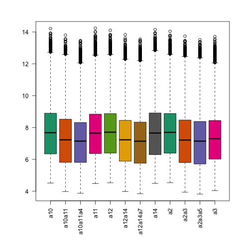
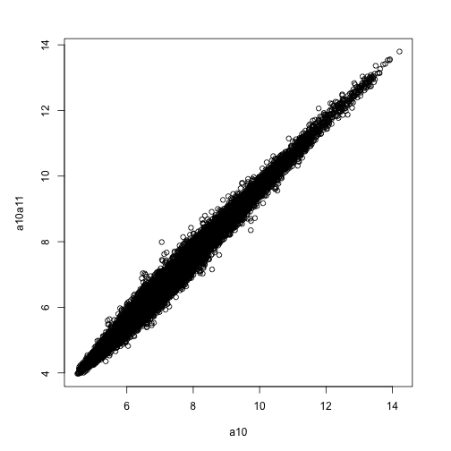
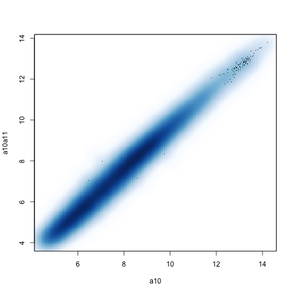
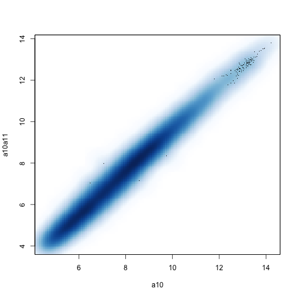

# Exploratory Data Analysis

In this document, we will review the meaning and how to generata some core plots for exploring data: boxplots, scatterplots, histograms and stripplots.

## Download and load a microarray expression set


```r
if (!"maPooling" %in% installed.packages()) {
    if (!"devtools" %in% installed.packages()) {
        install("devtools")
    }
    library("devtools")
    install_github("maPooling", "mikelove")
}
library("Biobase")
library("maPooling")
data("maPooling")
e <- maPooling
```


## Box plot


```r
library("RColorBrewer")
cols <- brewer.pal(8, "Dark2")
par(mar = c(7, 5, 3, 3))
boxplot(exprs(e)[, 1:12], col = cols, las = 2)
```

 


## Scatter plot


```r
par(mar = c(5, 5, 3, 3))
plot(exprs(e)[, 1:2])
```

 


```r
smoothScatter(exprs(e)[, 1:2])
```

```
## KernSmooth 2.23 loaded
## Copyright M. P. Wand 1997-2009
```

 


## Histogram


```r
hist(exprs(e)[, 1], col = "grey")
```

 


## Strip plot


```r
genes <- rownames(e)[1:5]
names(genes) <- genes
l <- lapply(genes, function(i) exprs(e)[i, ])
par(mar = c(5, 7, 3, 3))
stripchart(l, pch = 1, method = "jitter", las = 1)
```

 

