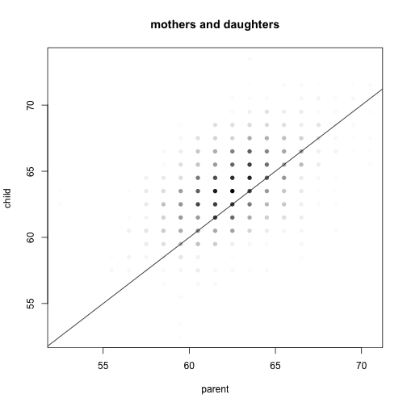
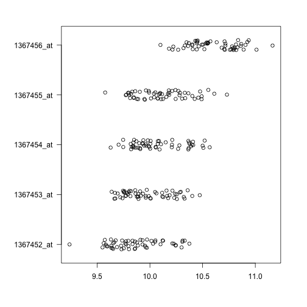

# Exploratory Data Analysis

In this document, we will review the meaning and how to generate some key plots for exploring data: scatterplots, boxplots, histograms and stripplots.

## On parents and children


```r
if (!"UsingR" %in% installed.packages()[, 1]) install.packages("UsingR")
library("UsingR")
```

```
## Loading required package: MASS
```

```r
data("father.son")
head(father.son)
```

```
##   fheight sheight
## 1   65.05   59.78
## 2   63.25   63.21
## 3   64.96   63.34
## 4   65.75   62.79
## 5   61.14   64.28
## 6   63.02   64.24
```

```r
plot(father.son$fheight, father.son$sheight, main = "Pearson's data set on heights\nof fathers and their sons")
abline(0, 1)
```

 


```r
if (!"HistData" %in% installed.packages()[, 1]) install.packages("HistData")
library("HistData")
data("PearsonLee")
head(PearsonLee)
```

```
##   child parent frequency gp    par chl
## 1  59.5   62.5      0.50 fs Father Son
## 2  59.5   63.5      0.50 fs Father Son
## 3  59.5   64.5      1.00 fs Father Son
## 4  60.5   62.5      0.50 fs Father Son
## 5  60.5   66.5      1.00 fs Father Son
## 6  61.5   59.5      0.25 fs Father Son
```

```r
maxfreq <- max(PearsonLee$freq)
PearsonLee$weight <- PearsonLee$freq/maxfreq
PearsonLee$col <- rgb(0, 0, 0, PearsonLee$weight)
with(PearsonLee[PearsonLee$gp == "fs", ], plot(parent, child, main = "fathers and sons", 
    pch = 16, col = col))
abline(0, 1)
```

 

```r
with(PearsonLee[PearsonLee$gp == "md", ], plot(parent, child, main = "mothers and daughters", 
    pch = 16, col = col))
abline(0, 1)
```

 


## Download and load a microarray expression set


```r
if (!"maPooling" %in% installed.packages()[, 1]) {
    if (!"devtools" %in% installed.packages()[, 1]) {
        install.packages("devtools")
    }
    library("devtools")
    install_github("maPooling", "mikelove")
}
library("Biobase")
library("maPooling")
data("maPooling")
e <- maPooling
```


## Box plot


```r
library("RColorBrewer")
cols <- brewer.pal(8, "Dark2")
par(mar = c(7, 5, 3, 3))
boxplot(exprs(e)[, 1:12], col = cols, las = 2)
```

 


## Scatter plot


```r
par(mar = c(5, 5, 3, 3))
plot(exprs(e)[, 1:2])
```

 


```r
smoothScatter(exprs(e)[, 1:2])
```

```
## KernSmooth 2.23 loaded
## Copyright M. P. Wand 1997-2009
```

 


## Histogram


```r
hist(exprs(e)[, 1], col = "grey")
```

 


## Strip plot


```r
genes <- rownames(e)[1:5]
names(genes) <- genes
l <- lapply(genes, function(i) exprs(e)[i, ])
par(mar = c(5, 7, 3, 3))
stripchart(l, pch = 1, method = "jitter", las = 1)
```

 

