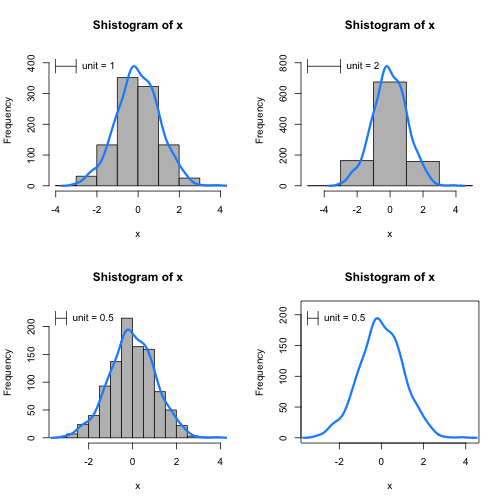

# EDA plots for microarray


```r
shistogram <- function(z, unit, plotHist = TRUE, add = FALSE, lineCol = "dodgerblue", 
    xlim, ylim) {
    n <- length(z)
    main <- paste("Shistogram of", deparse(substitute(z)))
    d <- density(z)
    ymax <- max(d$y * n * unit)
    if (missing(xlim)) {
        xlim <- c(min(z) - unit, max(z) + unit)
    }
    if (missing(ylim)) {
        ylim <- c(0, 1.1 * ymax)
    }
    if (plotHist) {
        h <- hist(z, breaks = seq(from = min(z) - unit, to = max(z) + unit, 
            by = unit), plot = FALSE)
        ylim[2] <- max(ylim[2], 1 * 1 * h$count)
        plot(h, col = "grey", main = main, xlab = deparse(substitute(z)), ylim = ylim, 
            xlim = xlim)
    } else {
        ymax <- ymax
        h <- hist(z, breaks = seq(from = min(z) - unit, to = max(z) + unit, 
            by = unit), plot = FALSE)
        if (!add) {
            plot(0, 0, type = "n", xlim = xlim, ylim = ylim, xlab = deparse(substitute(z)), 
                ylab = "Frequency", main = main)
        }
    }
    lines(d$x, d$y * n * unit, lwd = 3, col = lineCol)
    if (!add) {
        arrows(min(z) - unit, ymax, min(z), ymax, angle = 90, code = 3, length = 0.1)
        text(min(z), ymax, paste("unit =", unit), pos = 4)
    }
}
```


```r
set.seed(1)
n <- 1000
x <- rnorm(n)
par(mfrow = c(2, 2))
shistogram(x, unit = 1)
shistogram(x, unit = 2)
shistogram(x, unit = 0.5)
shistogram(x, unit = 0.5, plotHist = FALSE, xlim = c(-4, 7))
y <- rnorm(500, 2, 1)
shistogram(y, unit = 0.5, plotHist = FALSE, add = TRUE, lineCol = "firebrick")
```

 

